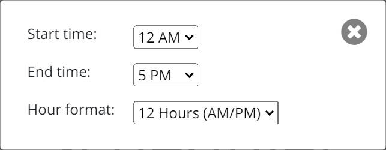
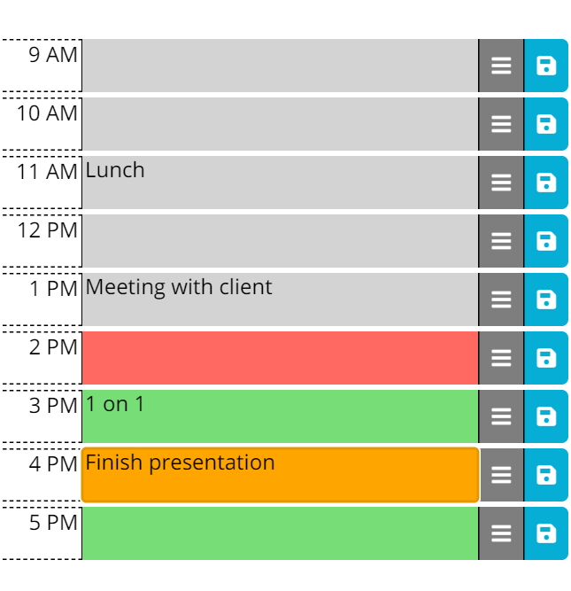
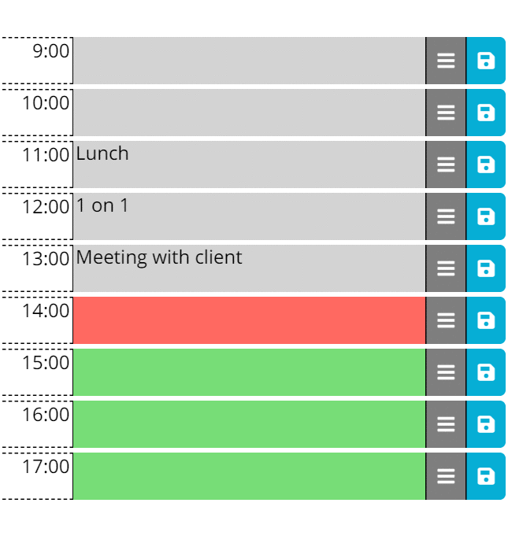

# Work Day Scheduler

## User Settings

* Start Time    [12 AM (0:00) to 11 PM (23:00)]         Default is 9 AM
* End Time      [ 1 AM (1:00) to 12 AM (24:00)]         Default is 6 PM
* Time Format   [12 Hours (AM/PM) or 24 Hours (0:00)]   Default is 12 Hours

## Example

* Gray: Time block is in the past
* Red: Time block is on the current hour
* Green: Time block is in the future
* Orange: Unsaved change

## Drag and Drop

Mouse down and hold or touch and hold on the move button allows the movement of a row to another location. Swaps the information between the two locations. Saving will add the data to local storage (Not saving the "from" location will create a copy of the event to a new location)

## Additional Features
* Preferences are configurable by the user, saved to local storage and applied immediately to the screen
* Unsaved changes are identified with orange background which is removed upon save
